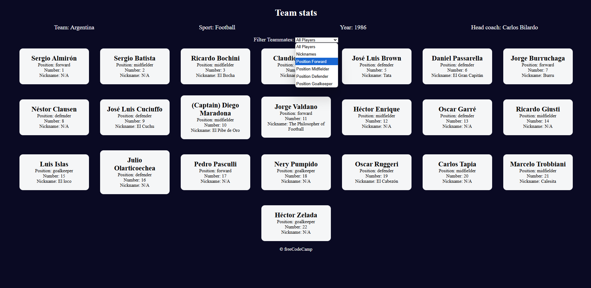

# Football Team Stats

## Overview

This project demonstrates how to use modern JavaScript methods to dynamically render and filter football team data. By interacting with the dropdown filter, users can view players based on specific criteria such as their position or whether they have a nickname.

## Features

- Display team stats including name, sport type, year, and head coach.
- Render player cards dynamically from an object.
- Filter players based on their position or nickname using a dropdown menu.
- Responsive design to ensure usability on various screen sizes.

## Technologies Used

- **HTML**: For structuring the webpage.
- **CSS**: For styling and responsive design.
- **JavaScript**: For dynamic content rendering and interactivity.

## Key Components

### HTML

The `index.html` file contains:
- A `main` section for displaying team stats and player cards.
- A `select` dropdown to filter players based on various criteria.

### CSS

The `styles.css` file includes:
- A dark theme for the page.
- Responsive design for mobile users.
- Styled player cards with rounded corners and spacing.

### JavaScript

The `script.js` file includes:
- A frozen object `myFavoriteFootballTeam` that holds team and player data.
- Functions to render player cards dynamically.
- Event listeners to handle dropdown menu changes and update displayed players.

## Usage

1. Clone the repository or download the files.
2. Open `index.html` in a browser.
3. Interact with the dropdown menu to filter players based on:
   - **All Players**: Show all players.
   - **Nicknames**: Show players with nicknames.
   - **Position Filters**: Show players by their position (Forward, Midfielder, Defender, Goalkeeper).

## Screenshot of the page

Below is an example of the webpage displaying the football team stats and player cards:

